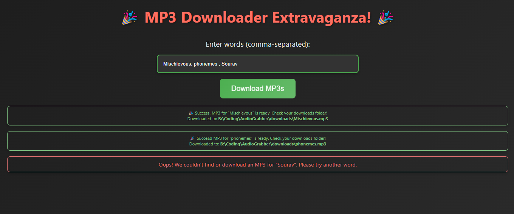

# 🎉 MP3 Downloader Extravaganza! 🎉

Welcome to the **MP3 Downloader Extravaganza!** 🚀 – your one-stop solution for downloading MP3s of pronunciations and more from the web, now with a side of humor and a sprinkle of modern pizzazz!

 <!-- Add the path to your screenshot here -->

## 📜 What It Does

Are you tired of manually downloading MP3 files for word pronunciations? Do you dream of an app that can fetch and download them all for you with a touch of style and speed? Look no further! This app is designed to make your life easier, one MP3 at a time. Just input your words, hit the button, and let the magic happen!

## 🚀 How It Works

1. **Enter Words**: Type in your words (comma-separated) into the input field.
2. **Press the Button**: Click the "Download MP3s" button.
3. **Watch the Magic**: A snazzy spinner will keep you entertained while we fetch your files.
4. **See Results**: Once the magic is done, you'll see the results – complete with download paths and any hiccups that might have occurred.

## 💻 Installation

Clone this repository and install the dependencies:

```bash
git clone https://github.com/SouravFrank/AudioGrabber.git
cd audiograbber
npm install
```

## 🛠️ Usage

Run the server:

```bash
npm start
```

Open your browser and navigate to `http://localhost:3000` to start using the MP3 Downloader Extravaganza!

## 📚 Storytime: The Origin

Once upon a time, in a land not so far away, my friend’s girlfriend was buried under a mountain of words that needed their pronunciations in MP3 format. 🏔️ My friend, being the ever-helpful partner, was manually downloading each MP3. Exhausted and on the brink of a "download-related" meltdown, he called me for help. 🤯

Seeing his plight, I thought, "There’s got to be a better way!" 💡 And just like that, fueled by midnight caffeine and a bit of code wizardry, the MP3 Downloader Extravaganza was born. 🎩✨ Now, thanks to this app, those MP3s are downloaded faster than you can say "supercalifragilisticexpialidocious"!

## 🎨 Styling & Features

- **Modern Look**: Featuring a stylish gradient background, sleek buttons, and contemporary fonts.
- **Loading Spinner**: Because waiting should look as good as it feels.
- **Responsive Design**: Works on all devices because no one should miss out on this awesomeness.
- **Error Handling**: Clear and colorful messages to keep you informed.

## 🔧 Contributing

Want to contribute? Awesome! Feel free to open an issue or submit a pull request. All contributions are welcome – whether it's a bug fix, new feature, or just a suggestion on how to make this app even more fabulous!

---

So, why wait? Dive into the MP3 Downloader Extravaganza today and make your digital life a bit more melodious! 🎵
